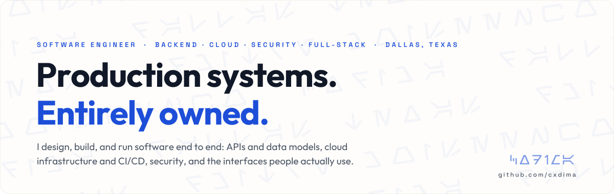
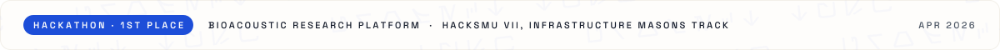

  

  &nbsp;
  &nbsp;
  &nbsp;
  &nbsp;
  

 

I build web platforms for real businesses and then keep them running. That means the Angular front end, the Python API behind it, the Terraform that stands it up, the tests and CI gates that guard it, and the alarms and runbooks for when something breaks at 2 a.m. Two of those platforms are in production today; on both I was the engineer of record from the first requirements call to the first incident.

- **Serverless on AWS** — API Gateway + Lambda, DynamoDB single-table design, Step Functions, Cognito, KMS, CloudFront, SES; all of it in Terraform/OpenTofu with CI that authenticates via OIDC and rolls back by Lambda alias
- **Security as a design input** — STRIDE and MITRE ATLAS threat models, KMS envelope encryption, zero-knowledge key handling, MFA and passkeys, tenant isolation, and scanners (bandit, checkov, gitleaks, pip-audit) that fail the build instead of warning
- **Client-facing delivery** — written scopes before building, iterative releases with demos, dated release notes, and audit reports a non-technical owner can act on

 

- Vaults are encrypted in the browser; the release key is **Shamir-split 2-of-3** across trusted contacts, so no server key can open a vault
- **81-route REST API** on a framework-free Python Lambda: JWT sessions, passkeys/WebAuthn, TOTP 2FA, rate limiting, Stripe webhooks with signature verification, 214 tests that run without AWS
- CI/CD on every push: tests → `tofu apply` → deploy → smoke test; alias-based rollback, CloudWatch alarms, cross-region replication with scripted restore drills; UI in six languages with i18n parity tests

- Multi-tenant platform that reconciles insurer payments against bank deposits for dental practices; live in the client's AWS account (ca-central-1) nine weeks after the contract was signed
- **87-endpoint REST API** (Pydantic validation, cursor pagination, conditional writes with a concurrency test suite) plus Step Functions-orchestrated Playwright connectors for bank and insurer portals
- PIPEDA/HIPAA-scope posture: Cognito with mandatory TOTP MFA, KMS envelope-encrypted credential vault, CloudTrail, STRIDE threat model, privacy impact assessment, incident-response runbook; **800+ Pytest tests** at 80%+ coverage, all security scanners blocking

- Led AWS architecture and frontend: private VPC with PrivateLink endpoints, Cognito TOTP MFA, KMS signing and envelope encryption, Fargate, zero wildcard IAM, Bedrock with no internet egress
- Threat model maps **25+ AI-agent threats to MITRE ATLAS** across five trust boundaries; on-chain threat sharing between deployments — [Devpost](https://devpost.com/software/clawguardian)

- Turns raw elephant field recordings into research-ready data for ElephantVoices; I led frontend and data visualization — an interactive 3D globe and waveform views in React, Next.js, Three.js, and wavesurfer.js — [Devpost](https://devpost.com/software/echofield) · [GitHub](https://github.com/ch1kim0n1/hacksmu26)

- The business behind this page's design system. Angular storefront on a serverless product/checkout API with Stripe payments; seven AWS services at roughly 60% lower cost than the managed hosting it replaced

 

<table>
<tr>
<td align="right" width="90"><b>Build</b></td>
<td>

</td>
</tr>
<tr>
<td align="right"><b>Run</b></td>
<td>

</td>
</tr>
<tr>
<td align="right"><b>Secure</b></td>
<td>

</td>
</tr>
<tr>
<td align="right"><b>Verify</b></td>
<td>

</td>
</tr>
</table>

 

- Finishing a B.S. in Software Engineering at UT Dallas (May 2027)
- Operating CorePractice in production for a Canadian client and shipping Vörd with a co-founder
- Open to Summer 2027 internships and new-grad roles in cloud, security, or full-stack engineering — Dallas or remote

 

  

